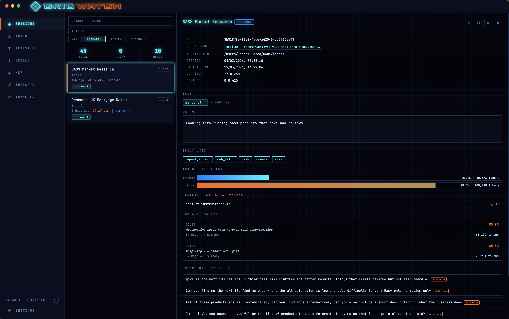
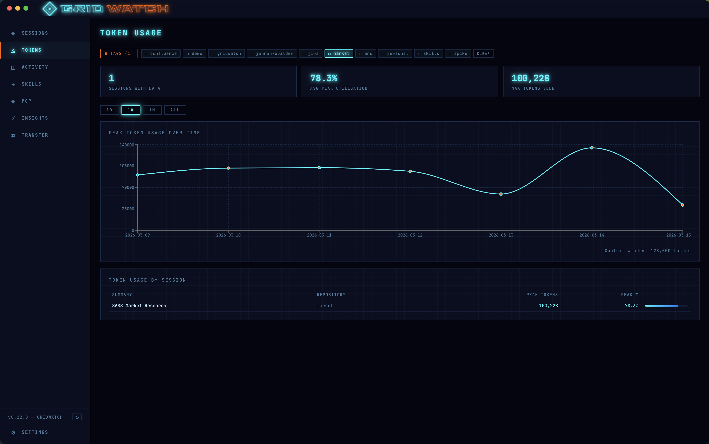
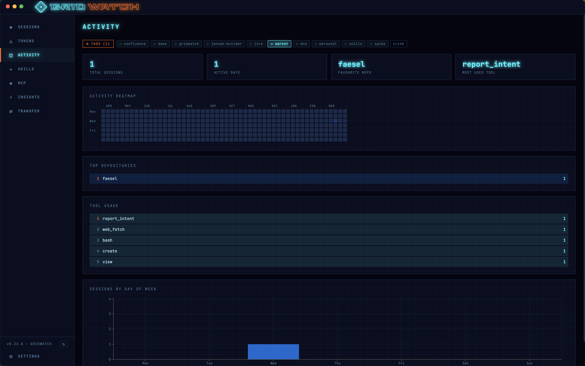
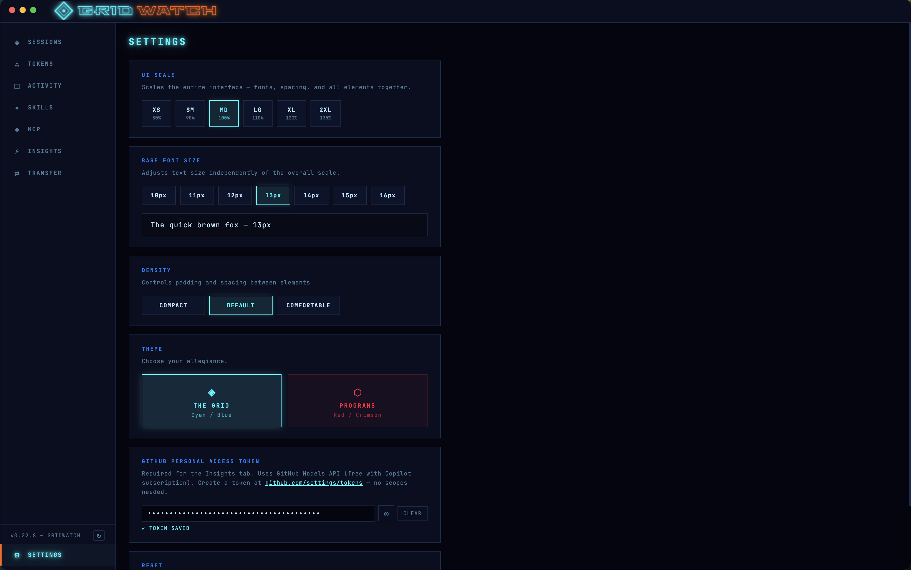
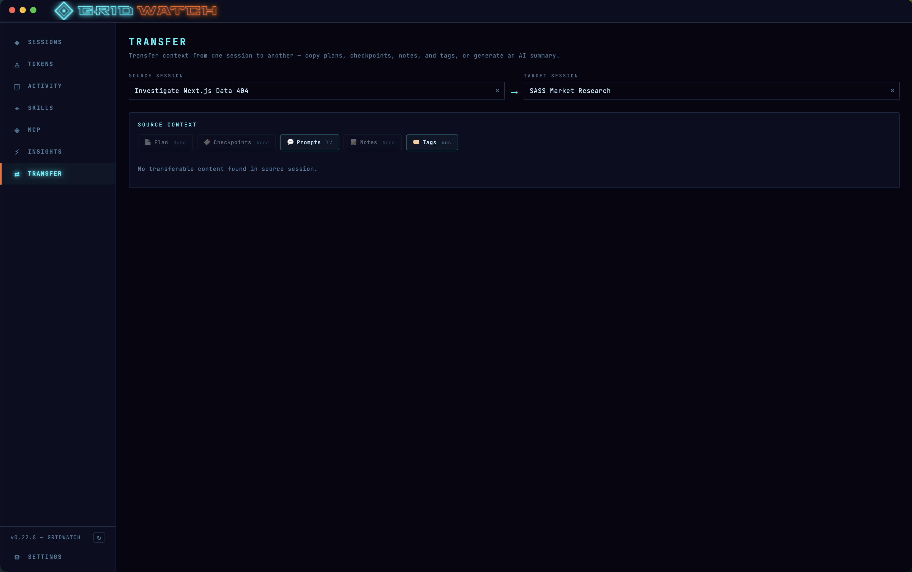

<div align="center">
  
  <h1>GridWatch</h1>
  <p><strong>🖥️ A retro-Tron-themed desktop dashboard for monitoring your GitHub Copilot CLI sessions</strong></p>
  <p>
    <a href="https://github.com/faesel/gridwatch/releases/latest"></a>
    <a href="https://github.com/faesel/gridwatch/blob/main/LICENSE"></a>
    <a href="https://github.com/faesel/gridwatch/releases"></a>
  </p>
</div>

GridWatch reads the local session data written by [GitHub Copilot CLI](https://githubnext.com/) to `~/.copilot/session-state/` and presents it as a beautiful, real-time dashboard — giving you visibility into your AI-assisted workflow across every project you work on.

---

## ✨ Features

- 📋 **Sessions overview** — browse all Copilot CLI sessions with live status, turn counts, token utilisation, and last prompt
- 🔍 **Search & tag filtering** — full-text search across sessions plus multi-select tag filtering with checkable tag chips
- 📄 **Pagination** — sessions list paged at 20 per page for fast loading
- 💬 **Prompt history** — read every user message from a session's `events.jsonl` directly in the UI
- 📈 **Token usage graphs** — line charts tracking peak context window usage over time with 1D / 1W / 1M / ALL time range filters
- 🟩 **Activity heatmap** — GitHub-style contribution grid showing your session activity over 52 weeks
- ⚡ **AI Insights** — analyse your sessions with OpenAI to get prompt quality scores and improvement suggestions
- 🏷️ **Tagging** — add, remove, and filter sessions by custom tags
- ✏️ **Rename sessions** — give sessions a meaningful name beyond the auto-generated summary
- 🗑️ **Archive / Delete** — safely archive or permanently remove old sessions (guards against deleting active sessions)
- 🔔 **Update notifications** — automatically checks GitHub Releases for new versions and shows a download banner
- ⚙️ **Settings** — adjustable UI scale, font size, and density presets, persisted between launches
- 🔄 **Auto-refresh** — dashboard refreshes every 30 seconds automatically
- 🎨 **Retro Tron theme** — neon cyan, electric blue, and orange accents on near-black backgrounds with JetBrains Mono typography

---

## 📸 Screenshots

### Sessions


### Tokens


### Activity


### Settings


### Insights


### Transfer


---

## 📋 Prerequisites

| Requirement | Version |
|---|---|
| Node.js | 18+ |
| npm | 9+ |
| GitHub Copilot CLI | Any version that writes to `~/.copilot/session-state/` |
| macOS / Windows | 10+ |

---

## 📥 Installation

### 💾 Download a release

Visit the [Releases](https://github.com/faesel/gridwatch/releases) page and download the installer for your platform:

- **macOS** — `.dmg` (arm64 or x64)
- **Windows** — `.exe` (NSIS installer)

#### 🍎 macOS: "app cannot be verified" warning

The app is not code-signed, so macOS Gatekeeper will block it on first launch. After dragging GridWatch to Applications, run:

```bash
xattr -cr /Applications/GridWatch.app
```

Then open GridWatch as normal. You only need to do this once.

#### 🔑 macOS: Keychain access prompt

On first launch, macOS may ask you to allow GridWatch to access its own keychain entry. This is used **only** to encrypt your GitHub Personal Access Token (if you add one for AI Insights). GridWatch does not read or access any other keychain items — the access is scoped exclusively to its own encryption key (`com.faesel.gridwatch`). You can safely click **Allow** or **Always Allow**.

> **Windows users:** No equivalent prompt appears. Windows uses DPAPI (Data Protection API) which encrypts data transparently under your Windows user account — no additional permissions are needed.

### 🔧 Build from source

```bash
# Clone the repository
git clone https://github.com/faesel/gridwatch.git
cd gridwatch

# Install dependencies
npm install

# Start in development mode
npm run dev
```

---

## 🛠️ Development

### 📁 Project structure

```
gridwatch/
├── electron/
│   ├── main.ts          # Main process — window creation, all IPC handlers
│   └── preload.ts       # Context bridge — exposes gridwatchAPI to renderer
├── src/
│   ├── pages/
│   │   ├── SessionsPage.tsx    # Sessions list + detail panel
│   │   ├── TokensPage.tsx      # Token usage charts
│   │   ├── ActivityPage.tsx    # Heatmap + activity analytics
│   │   ├── InsightsPage.tsx    # AI-powered prompt feedback
│   │   ├── InsightsPage.tsx    # AI-powered prompt feedback
│   │   ├── TransferPage.tsx    # Session context transfer
│   │   └── SettingsPage.tsx    # UI scale / font / density controls
│   ├── types/
│   │   ├── session.ts          # SessionData and related interfaces
│   │   └── global.d.ts         # Window.gridwatchAPI type declarations
│   ├── App.tsx                 # Shell layout, sidebar nav, auto-refresh
│   └── index.css               # Global styles + Tron design system variables
├── public/
│   └── icon.png                # App icon (1024x1024)
└── build/
    └── icon.png                # electron-builder icon source
```

### 📜 Available scripts

```bash
npm run dev          # Start development server with hot reload
npm run dev:debug    # Start with DevTools open (useful for debugging)
npm run build        # Type-check and build (clean first)
npm run clean        # Remove dist and dist-electron directories
npm run lint         # Run ESLint across the project
npm run pack:mac     # Build and package for macOS (creates .dmg files)
npm run pack:win     # Build and package for Windows (creates .exe installer)
npm run pack:all     # Build for all platforms
```

### 📊 Data sources

GridWatch reads exclusively from local files — no network requests are made except to check for updates and (optionally) to call the GitHub Models API for AI Insights.

| Data | Source |
|---|---|
| Session metadata | `~/.copilot/session-state/<uuid>/workspace.yaml` |
| Prompt history | `~/.copilot/session-state/<uuid>/events.jsonl` |
| Rewind snapshots | `~/.copilot/session-state/<uuid>/rewind-snapshots/index.json` |
| Token usage | `~/.copilot/logs/process-<timestamp>-<pid>.log` |
| Session tags / custom data | `~/.copilot/session-state/<uuid>/gridwatch.json` (written by GridWatch) |
| Encrypted API token | `~/.copilot/gridwatch-token.enc` (encrypted via OS keychain) |
| Update check | `api.github.com/repos/faesel/gridwatch/releases/latest` (on startup only) |

### 🔒 Security

- **Context isolation** — renderer process communicates with main only via a typed `gridwatchAPI` bridge; no generic IPC exposed
- **Sandbox enabled** — renderer runs in a sandboxed process
- **Content Security Policy** — strict CSP applied in production (no inline scripts)
- **Input validation** — all IPC handlers validate session IDs (UUID format) and file paths (traversal protection)
- **Encrypted secrets** — GitHub PAT encrypted at rest via Electron `safeStorage` (macOS Keychain / Windows DPAPI), scoped to GridWatch's own app identity only
- **URL restriction** — `shell.openExternal` limited to HTTP(S) URLs only
- **Hardened runtime** — macOS builds use hardened runtime for notarization compatibility

### ⚙️ Tech stack

| Layer | Technology |
|---|---|
| Framework | Electron |
| UI | React 19 + TypeScript |
| Build | Vite + vite-plugin-electron |
| Packaging | electron-builder |
| Styling | CSS Modules + CSS custom properties |
| Charts | Recharts |
| YAML parsing | js-yaml |
| Font | JetBrains Mono (@fontsource) |

### 🎨 Design system

The Tron-inspired colour palette is defined as CSS custom properties in `src/index.css`:

```css
--tron-bg:        #060a14   /* near-black background */
--tron-panel:     #0a0e1f   /* panel/card background */
--tron-cyan:      #00f5ff   /* primary accent */
--tron-blue:      #0080ff   /* secondary accent */
--tron-orange:    #ff6600   /* destructive / highlight */
--tron-border:    #1a2a4a   /* border colour */
```

---

## 🚀 Releasing

Releases are built and published automatically by GitHub Actions when a version tag is pushed.

```bash
# 1. Bump the version (choose one)
npm version patch --no-git-tag-version   # 0.5.4 → 0.5.5  (bug fixes)
npm version minor --no-git-tag-version   # 0.5.4 → 0.6.0  (new features)
npm version major --no-git-tag-version   # 0.5.4 → 1.0.0  (breaking changes)

# 2. Commit and push
git add package.json package-lock.json
git commit -m "chore: bump version to $(node -p "require('./package.json').version")"
git push origin main

# 3. Tag and push — this triggers the release workflow
VERSION=$(node -p "require('./package.json').version")
git tag "v$VERSION" && git push origin "v$VERSION"
```

The release workflow will:
1. Create a GitHub Release with auto-generated release notes
2. Build a `.dmg` for macOS (arm64 + x64) in parallel
3. Build an `.exe` NSIS installer for Windows (x64) in parallel
4. Upload both artifacts to the release

> **Note:** The macOS build is currently unsigned. See the [installation section](#macos-app-cannot-be-verified-warning) for the Gatekeeper workaround.

---

## 🤝 Contributing

Contributions are welcome! Please read [CONTRIBUTING.md](.github/CONTRIBUTING.md) before submitting a pull request.

---

## 📄 License

MIT — see [LICENSE](LICENSE) for details.

---

## 👤 Author

**Faesel Saeed**
[faesel.com](https://www.faesel.com) · [GitHub](https://github.com/faesel) · [LinkedIn](https://www.linkedin.com/in/faesel-saeed-a97b1614)
